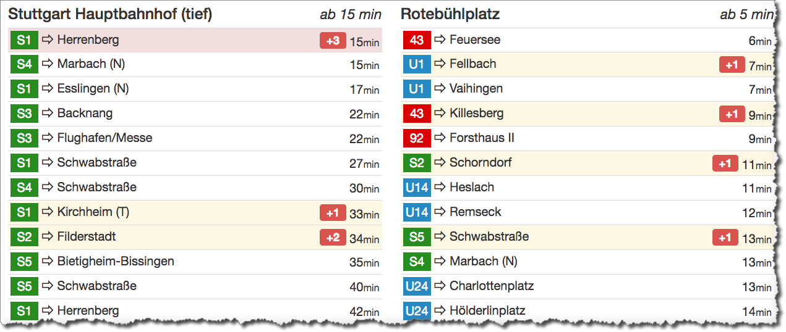

# VVS station monitor



## What's VVS?

VVS (VVS Verkehrs- und Tarifverbund Stuttgart) is the public transport group in stuttgart.

## What does the station monitor do?

The station monitor will show next departures from one or more stations
and will display also the delay.
The station monitor will refresh periodically and can be used for
infomation monitors.

### Examples

- [Stuttgart City](https://stationmonitor.lugbb.org/)
- [jweiland.net](https://stationmonitor.lugbb.org/jweiland.html)
- [Shackspace](https://stationmonitor.lugbb.org/shackspace.html)

## Configuration

Most configuration can be set in the HTML eg. custom filtering and 
other stuff. The configuration will be automatically taken 
from `data-xxx` attributes and will overwrite the configuration.

You can use Bootstrap classes and add more station lists, filter 
directions and lines (eg. no busses).

### Get station id

You can get the station id from https://efa-api.asw.io/api/v1/station/ 
or from the formular at vvs.de:


## Why `vvs.php`?

Because efa-api.asw.io doesn't allows CORS requests we need a local proxy
which proxies the requests to efa-api.asw.io and pass them to the local
web page.
It's not possible to access https://efa-api.asw.io/ directly via 
JavaScript (AJAX) so we currently need a local proxy.

## Customizing

All jQuery plugin configuration options for `vvsStation` can be easily configured as HTML attributes for each instance:

```
<div class="vvs-station" data-station="5006118" data-blacklist-line="^[0-9]+$" data-min-departure="15" data-max-departure="200"></div>

```


Configuration            | HTML attribute                  | Description
-------------------------|---------------------------------|--------------------------------------------------------------------------------------
station                  | data-station                    | VVS Station ID
departureType            | data-departure-type             | Specifies how the departure should be displayed (relative, absolute, intelligent)
minDeparture             | data-min-departure              | Minimum depature time
maxDeparture             | data-max-departure              | Maximum depature time
intelligentTimeThreshold | data-intelligent-time-threshold | Threshold for display relative/absolute time
blacklistDirection       | data-blacklist-direction        | Blacklist (regexp) for destionation (eg. Herrenberg, Schorndorf..)
whitelistDirection       | data-whitelist-direction        | Whitelist (regexp) for destionation (eg. Herrenberg, Schorndorf..)
blacklistLine            | data-blacklist-line             | Blacklist (regexp) for Line (eg. S1, 82, R123)
whitelistLine            | data-whitelist-line             | Whitelist (regexp) for Line (eg. S1, 82, R123)
maxEntries               | data-max-entries                | Max numbers of departures which will be shown
toggleTime               | data-toggle-time                | Seconds between time toggle (see enableTimeToggle)
enableTimeToggle         | data-enable-time-toggle         | Toggle between absolute and relative time

## Clock

There is also support for a clock in the right bottom edge, eg:

```
<div id="clock" class="alert alert-info"></div>
<script>
    jQuery( document ).ready(function($) {
        $("#clock").clock();
    });
</script>

```


## Special thanks

Special thanks to the guys from [OK Lab Stuttgart](http://codefor.de/stuttgart/) for the [VVS Api](http://codefor.de/projekte/2015-06-09-stgt-efa-meta-api)
